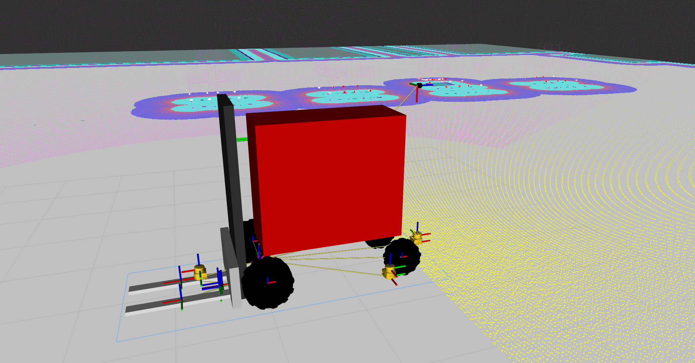
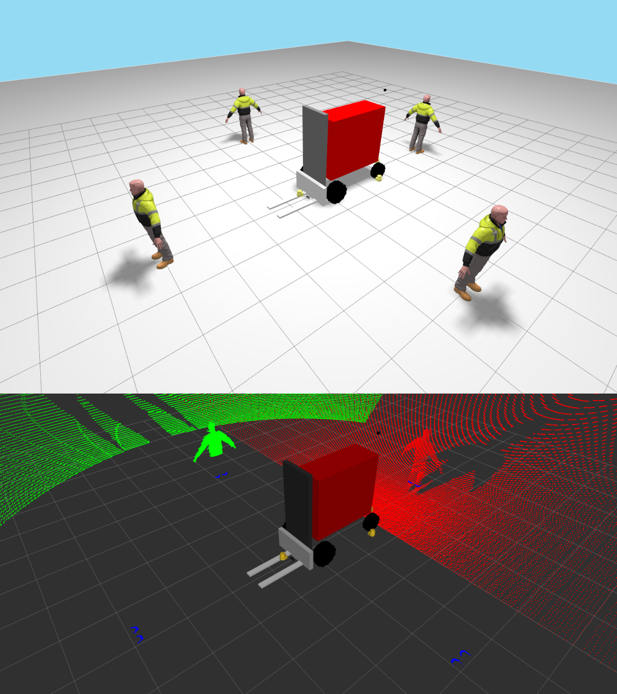

# robot_mima_mkv30

This package provides Xacro models, ROS 2 launch files, and simulation configuration for robots inspired by the MiMA MKV30 counterbalance forklift.

The package is prepared to support several robot models derived from the same MKV30 base. The current models are:

- `base`: basic MKV30-inspired robot model.
- `sensors1`: model based on `base`, with additional sensors placed in a specific layout.

Reference manufacturer information for the MKV30 model can be found at:

<https://www.es-forklift.com/3-0-3-5-4-0T-Counterbalance-Forklift-MKV30-35-40-pd719691098.html>



## What Is Included

The package includes:

- Xacro robot files.
- Per-model configuration under `config/model_*`.
- Main robot launch file: `launch/robot.launch.py`.
- Local debug launch file: `launch/debug_robot.launch.py`.
- ROS-Gazebo bridge, simulation, RViz, and `ros2_control` configuration.

## Normal Use

Launch the robot with:

```bash
ros2 launch robot_mima_mkv30 robot.launch.py ...
```

The most relevant launch arguments are:

- `robot_model`: selects the model to launch, for example `base` or `sensors1`.
- `robot_name`: sets the robot name used by the launch file.
- `params_file`: selects the ROS parameter file.
- `params_file_allow_substs`: enables or disables substitutions inside the parameter file.
- `model_xacro_args_file`: selects the file with Xacro arguments for the model.
- `sim_file`: selects the simulation configuration file.

## Model Configuration

Each model has its own package-maintained configuration under `config/model_<name>`.

For `sensors1`, the main default files are:

- `config/model_sensors1/default_params.yaml`
- `config/model_sensors1/default_model_xacro_args.yaml`
- `config/model_sensors1/default_simulation.yaml`
- `config/model_sensors1/default_bridge.yaml`

These files are not generic examples. They are the default configuration maintained by this package
for the `sensors1` model.

A user can add another model, for example `sensors2`, by adding the required Xacro files,
configuration files, and package wiring needed to expose that model.

## Debugging The sensors1 Model

The package includes a quick debug flow for checking the `sensors1` model in Gazebo Sim and RViz.

Call the installed script:

```bash
$(ros2 pkg prefix robot_mima_mkv30)/share/robot_mima_mkv30/scripts/debug_model_sensors1_with_defaults.sh
```

The script uses the package defaults from `model_sensors1`. It is meant to run the known package
configuration without having to pass the default files by hand.



## Notes

The MiMA-specific controllers are not publicly released yet.
